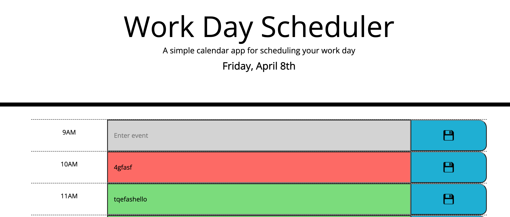
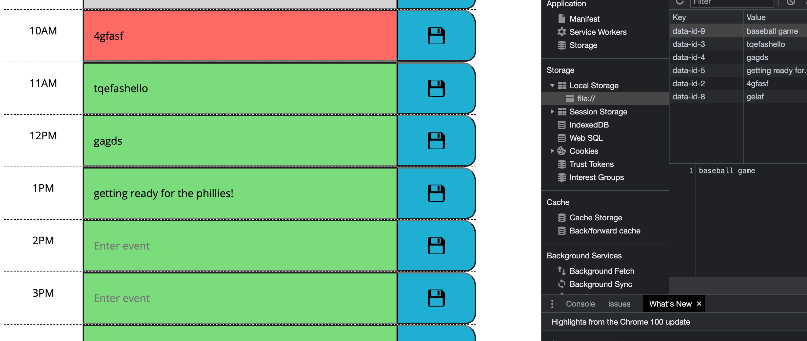

# Day-Planner

## About Application:
This application, you are able to save things to do during the day to local storage based on the time of day you desire.  The time of day determines what color that the ties for each hour are.  The Gray color is for past hours, Red is for the current hour and Green is for the hours that are still coming up in the day.


## List of technologies used
- Javascript
- JQuery
- Bootstrap


## User Story

My task for this homework is to create a day planner that is interactive and saves the data so it stays if you refresh.  The color of the times change based on the time of day.

## My Task

My task is to create a daily planner for my client.  This will let you save events per hour and the hours are shown if they are present past or future hours based on the color.

## Acceptance Citeria
```md
GIVEN I am using a daily planner to create a schedule
WHEN I open the planner
THEN the current day is displayed at the top of the calendar
WHEN I scroll down
THEN I am presented with timeblocks for standard business hours
WHEN I view the timeblocks for that day
THEN each timeblock is color coded to indicate whether it is in the past, present, or future
WHEN I click into a timeblock
THEN I can enter an event
WHEN I click the save button for that timeblock
THEN the text for that event is saved in local storage
WHEN I refresh the page
THEN the saved events persist
```

## Github Link
https://mclanea92.github.io/Day-Planner/


## Live link to deployed app
https://mclanea92.github.io/Day-Planner/


## Contact/Questions
If you have any questions about this project, please feel free to contact me at mclanea92@gmail.com

## Screenshots

The screenshot below shows that the day and date are displayed at the top of the page




The screenshot below shows that when save button hit, it saves to localstorage and corresponds to the correct time of day.  When the page is refreshed, it will reload into the same time slot.




## License
MIT License

Copyright (c) 2022 Adam McLane

Permission is hereby granted, free of charge, to any person obtaining a copy
of this software and associated documentation files (the "Software"), to deal
in the Software without restriction, including without limitation the rights
to use, copy, modify, merge, publish, distribute, sublicense, and/or sell
copies of the Software, and to permit persons to whom the Software is
furnished to do so, subject to the following conditions:

The above copyright notice and this permission notice shall be included in all
copies or substantial portions of the Software.

THE SOFTWARE IS PROVIDED "AS IS", WITHOUT WARRANTY OF ANY KIND, EXPRESS OR
IMPLIED, INCLUDING BUT NOT LIMITED TO THE WARRANTIES OF MERCHANTABILITY,
FITNESS FOR A PARTICULAR PURPOSE AND NONINFRINGEMENT. IN NO EVENT SHALL THE
AUTHORS OR COPYRIGHT HOLDERS BE LIABLE FOR ANY CLAIM, DAMAGES OR OTHER
LIABILITY, WHETHER IN AN ACTION OF CONTRACT, TORT OR OTHERWISE, ARISING FROM,
OUT OF OR IN CONNECTION WITH THE SOFTWARE OR THE USE OR OTHER DEALINGS IN THE
SOFTWARE.